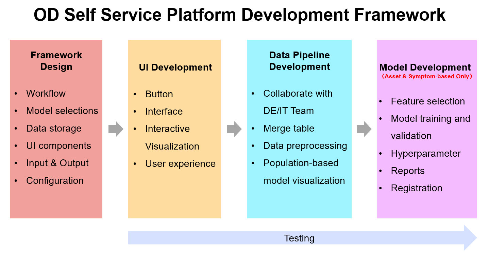
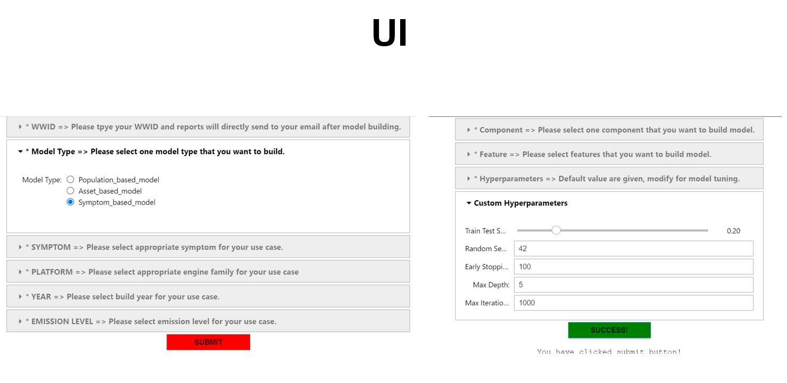
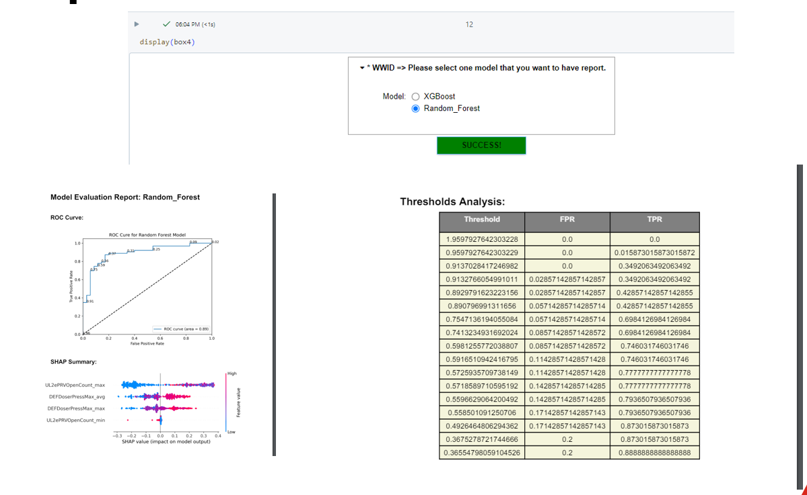

# Smart diagonsis model generation
 
# Optimized Diagnosis (OD) Model for Cummins Digital

## Project Overview

This machine learning project was developed during my tenure at Cummins Digital. We created a generative model for global teams, focusing on optimized diagnostic features. While some information is hidden due to parent protection policies, the core details adhere to our company's data protection guidelines.

## Problems Addressed

Traditional diagnostic methods are time-consuming and inefficient. For example, diagnosing an engine issue often involves a lengthy process of disassembly and replacement. Additionally, deploying a single component end-to-end takes a significant amount of time. Currently, there is no self-service data science capability for non-coders who want to create ML models for diagnostic purposes.

## Solution

By developing a scalable OD template, we provide a solution that facilitates the creation of ML models for multiple components in less time. This enables developers to train and deploy OD models in production using a low-code/no-code approach.

## Application

**Portal:** eAPP - Diagnosis Expert Module

### User Journey

When a truck arrives at a service station, the technician uses the eCummins app on their phone. After authorization, they check the symptoms and fault codes using engine telematics data. Previously, diagnosing an engine "miss fire" issue involved more than ten steps. Now, with the optimized diagnosis model, the high potential root causes are prioritized, allowing the technician to resolve the issue within three steps. This results in reduced downtime and lower repair costs for customers.

We cover over 1000 failure diagnosis scenarios in engines. By leveraging telematics data, we achieve highly efficient diagnostics.

## Framework

1. **Configuration**
2. **Data Processing**
3. **Model Training**
4. **Backward Validation**
5. **Evaluation and Model Registration**

## Deliverables

- Multiple diagnosis ML models
- Potential diagnosis solution ranking

## APPENDIX

- Framework

- UI 

- Auto Report

